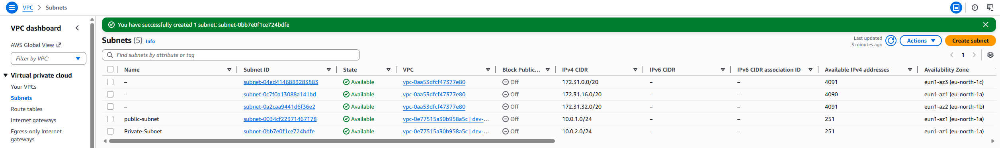
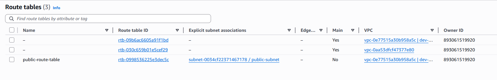
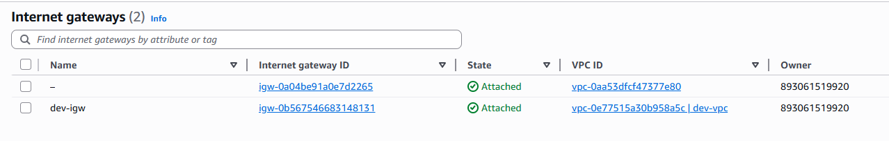
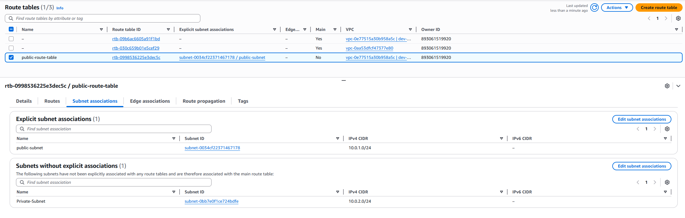
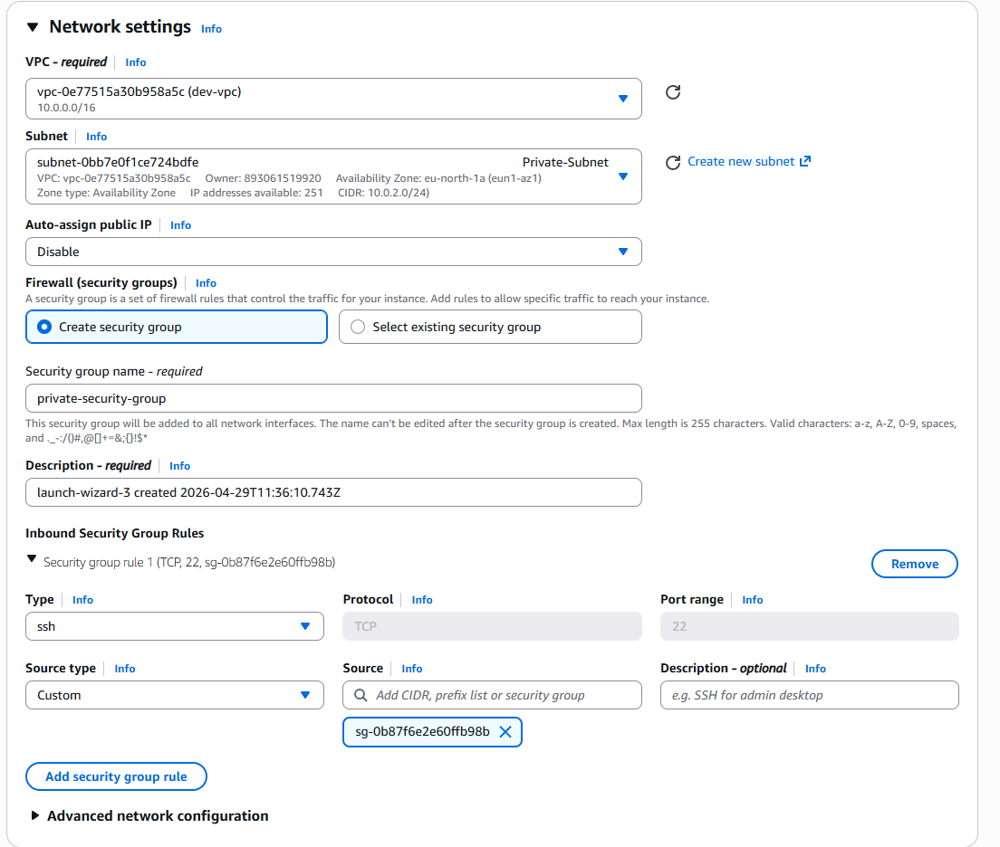
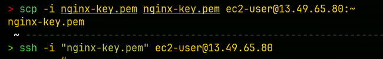
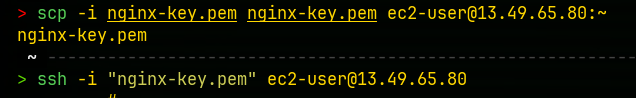
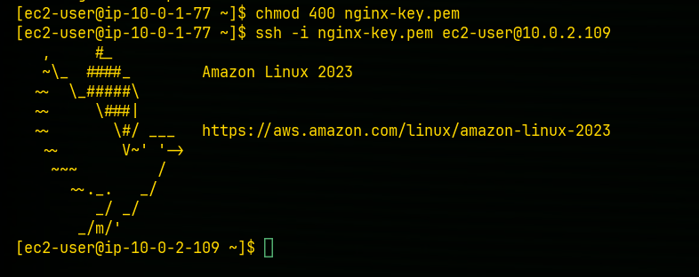

# AWS Assignment 1 – VPC & Networking

## 📌 Overview

In this project, I built a custom AWS network from scratch to understand how cloud networking works in a real-world environment.

The goal was to design a secure and scalable infrastructure using core AWS services such as VPC, subnets, route tables, and EC2.

---

## 🧱 Architecture

* Custom VPC: `10.0.0.0/16`
* Public Subnet: `10.0.1.0/24`
* Private Subnet: `10.0.2.0/24`
* Internet Gateway for public access
* Route tables configured for correct traffic flow
* EC2 instances deployed in both subnets

---

## 🔐 Security Design

### Public EC2

* Accessible via SSH (port 22) from my IP
* HTTP (port 80) allowed for web traffic

### Private EC2

* No public IP
* Only accessible via the public EC2 (bastion-style access)

---

## 🔄 Connectivity Flow

1. SSH into public EC2 using a key pair
2. Transfer `.pem` key securely to the public instance
3. SSH from public EC2 → private EC2 using private IP

This simulates a real-world secure architecture where internal servers are not exposed to the internet.

---

## 📸 Screenshots

### VPC Overview

Path: `./screenshots/VPC Overview.png`

---

### Subnets

Path: `./screenshots/Subnets.png`

---

### Route Tables

Path: `./screenshots/Route-Tables.png`

---

### Internet Gateway

Path: `./screenshots/Internet-Gateways.png`

---

### Subnet Association

Path: `./screenshots/Subnet-Association.png`

---

## 🖥️ EC2 Configuration

### Private EC2 (No Public IP)

Path: `./screenshots/private-ec2-no-public-ip.png`

---

## 🔐 Bastion Access (Public → Private EC2)

### Step 1

Path: `./screenshots/Bastion-part1.png`

---

### Step 2

Path: `./screenshots/bastion-part2.png`

---

### Step 3

Path: `./screenshots/bastion-part3.png`

---

## 💡 What I Learned

* How AWS networking works under the hood
* The difference between public and private subnets
* How routing controls internet access
* How to securely access private resources using a bastion host
* Importance of security groups and least privilege access

---

## 🚧 Challenges Faced

* Understanding CIDR ranges and subnet sizing
* Debugging SSH access issues between instances
* Managing key permissions (`chmod 400`)
* Structuring the network correctly to allow internal communication

---

## ✅ Outcome

Successfully built a secure AWS network where:

* Public resources are accessible
* Private resources remain protected
* Internal communication works correctly

This forms the foundation for more advanced cloud setups such as load balancing, auto scaling, and Kubernetes.
