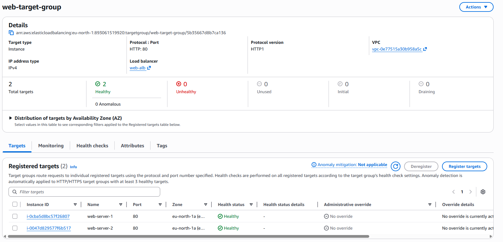

# AWS Load Balancer Setup

## Overview

In this project, I built a highly available web architecture using AWS.

I launched two EC2 instances in a public subnet and placed them behind an Application Load Balancer (ALB) to distribute traffic between them.

---

## Architecture

- VPC: dev-vpc (10.0.0.0/16)
- Public Subnet: 10.0.1.0/24
- 2 EC2 instances running Apache (httpd)
- Application Load Balancer
- Target Group for routing traffic

---

## Steps Completed

### 1. Launched Two EC2 Instances

- web-server-1
- web-server-2

Both instances:
- Amazon Linux 2023
- t3.micro
- Public IP enabled
- Same security group (web-sg)

---

### 2. Installed Web Server

Used user data to install Apache and serve different responses:

Server 1:

Server 2:

---

### 3. Created Security Group for ALB

- Name: alb-sg
- Inbound: HTTP (80) from 0.0.0.0/0
- Outbound: All traffic

---

### 4. Created Target Group

- Name: web-target-group
- Protocol: HTTP
- Port: 80
- Registered both EC2 instances

---

### 5. Created Application Load Balancer

- Internet-facing
- Attached to public subnets
- Uses alb-sg
- Listener: HTTP on port 80
- Forwarding to web-target-group

---

## Testing

Accessed the Load Balancer DNS in the browser.

After refreshing the page multiple times, the response alternated between:

- Hello from Web Server 1
- Hello from Web Server 2

This confirmed that traffic was successfully distributed across both EC2 instances.

---

## Health Check Verification

Both instances showed as healthy in the target group:

---

## Key Learnings

- Load balancers distribute traffic across multiple servers
- Target groups manage backend instance health
- Security groups must allow HTTP traffic for ALB to function
- Public subnets require public IP assignment for direct access

---

## Cleanup

To avoid unnecessary costs:
- Deleted Load Balancer
- Deleted Target Group
- Stopped EC2 instances
