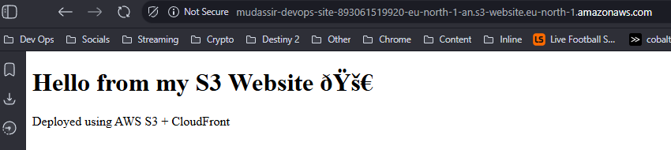

# AWS Assignment 3 — S3 Static Website + CloudFront CDN

## Overview

In this project, I deployed a static website using Amazon S3 and improved its performance and global availability using CloudFront.

---

## Architecture

* S3 bucket used for static website hosting
* Public access configured via bucket policy
* CloudFront distribution used as CDN
* Default root object: index.html

---

## Steps Performed

### 1. Created S3 Bucket

* Enabled static website hosting
* Uploaded index.html

### 2. Configured Bucket Policy

* Allowed public read access to objects

### 3. Verified S3 Website

* Accessed via S3 website endpoint

---

### 4. Created CloudFront Distribution

* Origin: S3 website endpoint
* Default root object: index.html
* Used recommended cache settings

---

### 5. Verified CloudFront CDN

Accessed the website via CloudFront domain:

---

## Key Learnings

* S3 can host static websites without servers
* CloudFront improves performance using edge locations
* Proper origin configuration is critical for functionality
* CDN adds scalability and reliability

---

## Cleanup

* Disabled CloudFront distribution to avoid unnecessary charges
* S3 bucket retained for portfolio demonstration

---

## Outcome

Successfully deployed a globally accessible static website using AWS S3 and CloudFront.
