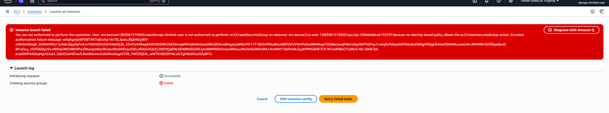
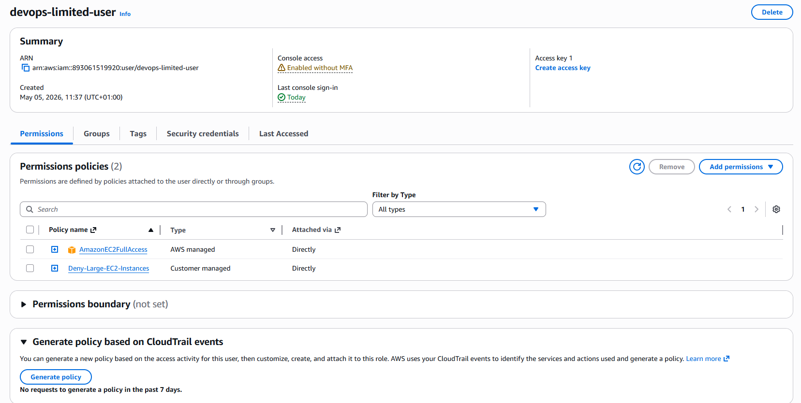
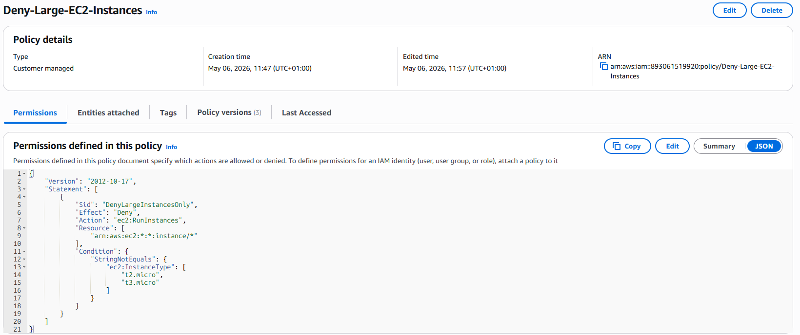
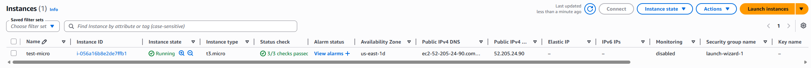
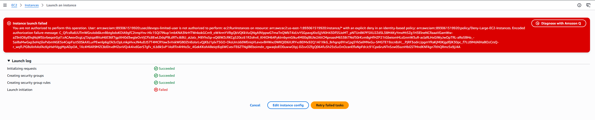

# AWS Assignment 4 — IAM & Security

## Overview

In this project, I implemented AWS Identity and Access Management (IAM) to move away from using the root account and apply the principle of least privilege.

The goal was to create users with controlled access, validate permission enforcement, and implement custom IAM policies to restrict EC2 instance launches.

---

## Objectives

* Create IAM users
* Assign permissions using managed and custom policies
* Understand least privilege access
* Test and validate restricted permissions
* Implement explicit deny policies for EC2 control

---

# Services Used

- AWS IAM
- Amazon EC2
- AWS Managed Policies
- Customer Managed Policies

---

## 1. Created IAM Admin User

* Created an IAM user with administrative permissions
* Used this user instead of the root account for daily AWS tasks

This follows AWS security best practices by avoiding root account usage for routine operations.

---

## 2. Created Limited IAM User

Created a new IAM user:

- `devops-limited-user`

Enabled:

- AWS Management Console access

Initially assigned read-only permissions:

- `AmazonEC2ReadOnlyAccess`
- `AmazonS3ReadOnlyAccess`
- `CloudFrontReadOnlyAccess`

This simulated a restricted-access developer account.

---

## 3. Tested Initial Permission Restrictions

Logged in as the limited user and attempted administrative EC2 actions.

The user was denied permission to launch EC2 instances due to insufficient access rights.

This validated that IAM restrictions were functioning correctly.

---

## 4. Implemented Managed and Custom IAM Policies

Updated the IAM user permissions to include:

- `AmazonEC2FullAccess`
- `Deny-Large-EC2-Instances`

This combined:

- AWS managed permissions
- Customer-managed security restrictions

to create a more controlled least-privilege model.

---

## 5. Created Custom EC2 Restriction Policy

Created a customer-managed IAM policy:

- `Deny-Large-EC2-Instances`

The policy used explicit deny logic to restrict larger EC2 instance types while allowing approved micro instances.

Allowed instance types:

- `t2.micro`
- `t3.micro`

This demonstrated practical IAM policy customization and access control.

---

## 6. Tested Allowed EC2 Launch

Successfully launched:

- `t3.micro`

This confirmed that approved EC2 instance types could be launched successfully under the custom policy configuration.

---

## 7. Tested Restricted EC2 Launch

Attempted to launch:

- `t3.large`

The launch was denied due to the explicit deny policy.

This confirmed that the IAM restrictions were actively enforced.

---

## Key Learnings

* Root account should not be used for daily operations
* IAM enables secure access control in AWS
* Managed and custom policies can be layered together
* Explicit deny rules override allow permissions
* Least privilege is critical for cloud security
* IAM troubleshooting is an important cloud engineering skill
* AWS resource provisioning can involve multiple dependent permissions

---

## Cleanup

* Terminated test EC2 instances after validation
* Retained IAM users and policies for continued learning
* Avoided unnecessary elevated permissions

---

## Outcome

Successfully implemented IAM security best practices using:

- IAM users
- Managed policies
- Customer-managed policies
- Explicit deny rules
- EC2 launch restrictions

This project strengthened my understanding of AWS identity management, permission boundaries, and least-privilege access control in real-world cloud environments.
