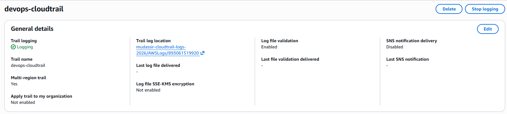
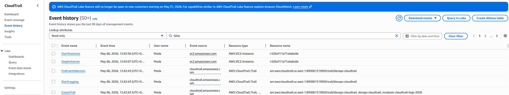

# AWS Assignment 6 — CloudTrail Monitoring & Auditing

## Overview

In this project, I implemented AWS CloudTrail to monitor and log activity across my AWS environment.

The goal was to understand how AWS records API activity, user actions, and infrastructure events for security, auditing, and governance purposes.

---

## Objectives

* Create a CloudTrail trail
* Store audit logs in Amazon S3
* Monitor AWS account activity
* Track EC2 instance actions
* Validate CloudTrail event logging

---

## 1. Created CloudTrail Trail

Created a multi-region CloudTrail trail named:

```text
devops-cloudtrail
```

Configured CloudTrail to:

* Capture management events
* Record both read and write activity
* Store logs in an S3 bucket
* Enable log file validation

---

## 2. Configured S3 Log Storage

Created a dedicated S3 bucket for CloudTrail logs.

The bucket stores account activity records generated by AWS services and user actions.

### Screenshot



---

## 3. Generated AWS Activity Events

Generated AWS API activity by:

* Stopping an EC2 instance
* Starting the EC2 instance again
* Accessing AWS services through the console

These actions created audit events within CloudTrail.

---

## 4. Verified Event History

Reviewed CloudTrail Event History and confirmed that AWS successfully logged:

* StartInstances
* StopInstances
* CreateTrail
* StartLogging

The logs included:

* Event name
* Username
* Resource type
* Timestamp
* AWS service source

### Screenshot



---

## Key Learnings

* CloudTrail provides visibility into AWS account activity
* AWS records both console actions and API calls
* Audit logging is essential for security and compliance
* Event history helps track operational and security changes
* CloudTrail improves accountability and governance

---

## Cleanup

* Terminated EC2 test instances
* Deleted unnecessary monitoring alarms
* Retained CloudTrail trail and S3 logs for future reference

---

## Outcome

Successfully implemented AWS CloudTrail to capture and monitor infrastructure activity, demonstrating foundational cloud auditing and security monitoring skills.
