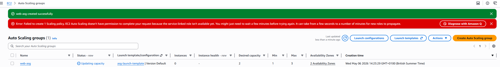
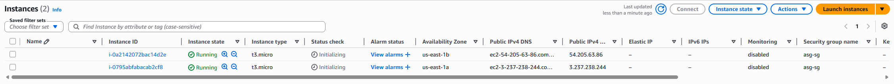

# AWS Assignment 7 — Auto Scaling Groups

## Overview

In this project, I implemented AWS Auto Scaling to automatically launch and manage EC2 instances based on desired capacity settings.

The goal was to understand how AWS automatically maintains infrastructure availability and scalability across multiple Availability Zones.

---

## Objectives

* Create a Launch Template
* Configure an Auto Scaling Group (ASG)
* Automatically launch EC2 instances
* Distribute instances across Availability Zones
* Understand self-healing and scalable infrastructure

---

## 1. Created Launch Template

Created an EC2 Launch Template named:

```text
asg-launch-template
```

Configured the template with:

* Amazon Linux 2023 AMI
* t3.micro instance type
* HTTP security group
* User data script to install Apache web server

### User Data Script

```bash
#!/bin/bash
yum update -y
yum install -y httpd
systemctl start httpd
systemctl enable httpd
echo "<h1>Auto Scaling Web Server</h1>" > /var/www/html/index.html
```

### Screenshot


---

## 2. Created Auto Scaling Group

Created an Auto Scaling Group named:

```text
web-asg
```

Configuration:

* Desired capacity: 2
* Minimum capacity: 1
* Maximum capacity: 3
* Distributed across 2 Availability Zones
* Target tracking scaling policy using CPU utilization

### Screenshot



---

## 3. Verified Automatic Instance Launching

After the Auto Scaling Group was created, AWS automatically launched EC2 instances using the launch template configuration.

The instances were distributed across multiple Availability Zones to improve availability and fault tolerance.

### Screenshot



---

## Key Learnings

* Auto Scaling automatically maintains infrastructure capacity
* Launch Templates standardize EC2 deployment configurations
* Auto Scaling improves fault tolerance and scalability
* Infrastructure can self-heal by replacing failed instances
* Multi-AZ deployments improve high availability

---

## Cleanup

* Deleted Auto Scaling Group
* Terminated EC2 instances
* Deleted Launch Template
* Removed unnecessary security groups

---

## Outcome

Successfully implemented AWS Auto Scaling Groups to automatically deploy and manage EC2 infrastructure across multiple Availability Zones, demonstrating scalable and resilient cloud architecture concepts.
