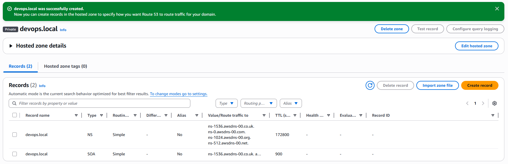
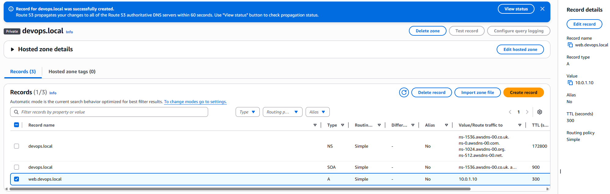

# AWS Assignment 8 — Route 53 DNS Management

## Overview

In this project, I implemented AWS Route 53 to understand DNS management and hosted zone configuration within AWS.

The goal was to learn how AWS handles DNS records, domain routing, and internal network name resolution.

---

## Objectives

* Create a Route 53 hosted zone
* Configure DNS records
* Understand private DNS routing
* Learn hosted zone management concepts

---

## 1. Created Hosted Zone

Created a private hosted zone using Route 53.

Configuration included:

* Private hosted zone type
* Associated with default VPC
* Configured within the us-east-1 region

The hosted zone automatically generated:

* NS (Name Server) records
* SOA (Start of Authority) records

### Screenshot

---

## 2. Created DNS Record

Created a DNS A record within the hosted zone.

Configuration:

* Record name: `web`
* Record type: `A`
* Private IP target value

This demonstrated how Route 53 routes traffic internally using DNS records.

### Screenshot

---

## Key Learnings

* Route 53 manages DNS records and hosted zones
* Hosted zones organize DNS configurations
* Private hosted zones support internal AWS networking
* DNS records map names to resources/IP addresses
* Route 53 is a core AWS networking service

---

## Cleanup

* Retained hosted zone for continued learning
* No public domains were purchased

---

## Outcome

Successfully implemented AWS Route 53 hosted zones and DNS records, demonstrating foundational DNS and cloud networking concepts within AWS.
