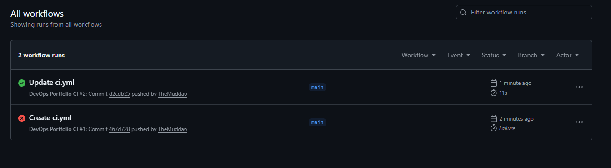

# AWS Assignment 9 — CI/CD with GitHub Actions

## Overview

In this project, I implemented a basic CI/CD workflow using GitHub Actions.

The goal was to automate repository validation whenever code was pushed to the main branch, introducing core DevOps automation concepts.

---

## Objectives

* Create a GitHub Actions workflow
* Automate repository validation
* Trigger workflows on GitHub pushes
* Understand CI/CD fundamentals

---

## 1. Created GitHub Actions Workflow

Created a workflow file located at:

```text
.github/workflows/ci.yml
```

The workflow was configured to:

* Trigger automatically on pushes to the `main` branch
* Run on Ubuntu GitHub runners
* Validate repository structure
* Execute automated workflow steps

### Workflow Configuration

```yaml
name: DevOps Portfolio CI

on:
  push:
    branches:
      - main

jobs:
  validate-repo:
    runs-on: ubuntu-latest

    steps:
      - name: Checkout Repository
        uses: actions/checkout@v4

      - name: Display Repository Structure
        run: ls -R

      - name: CI Validation Complete
        run: echo "GitHub Actions workflow executed successfully!"
```

---

## 2. Verified Workflow Execution

After committing the workflow file, GitHub Actions automatically executed the pipeline.

The workflow completed successfully and validated the repository configuration.

### Screenshot



---

## Key Learnings

* CI/CD automates development workflows
* GitHub Actions provides built-in automation pipelines
* Workflows can automatically validate repository changes
* Automation improves consistency and reliability
* CI/CD is a core DevOps practice

---

## Cleanup

* Retained GitHub Actions workflow for continued automation practice

---

## Outcome

Successfully implemented a basic CI/CD pipeline using GitHub Actions, demonstrating foundational DevOps automation and continuous integration concepts.
