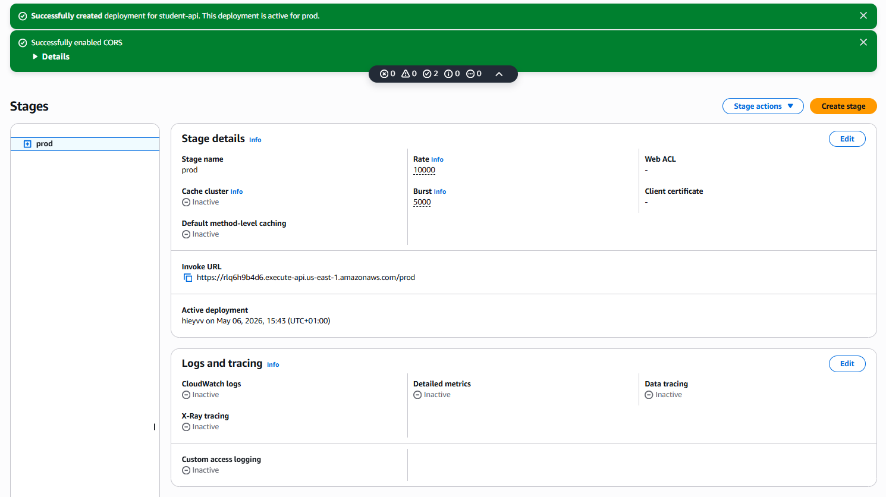
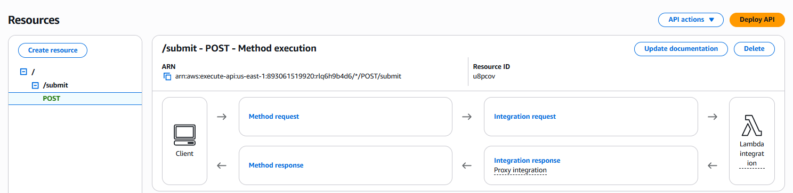
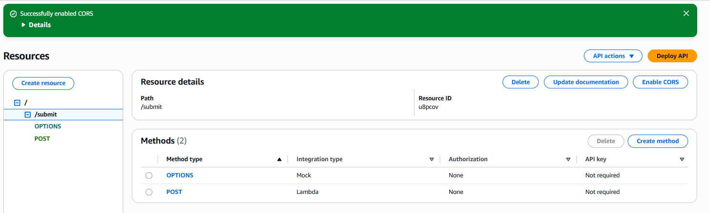
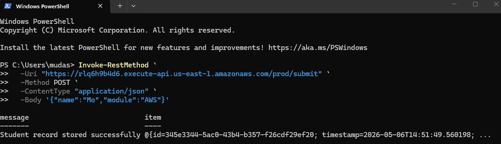
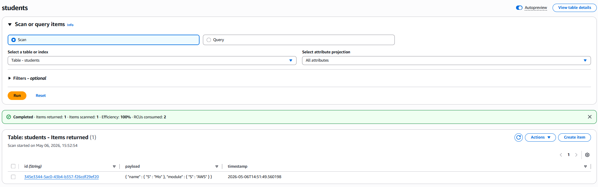
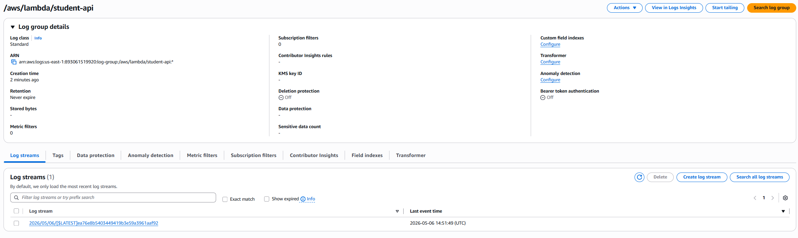

# AWS Serverless API with Lambda, API Gateway & DynamoDB

## 📌 Project Overview

This project demonstrates a serverless API built using AWS Lambda, API Gateway, and DynamoDB.

The API accepts POST requests, stores data in DynamoDB, and returns a structured JSON response.

---

## 🛠️ Technologies Used

- AWS Lambda
- Amazon API Gateway
- Amazon DynamoDB
- IAM Roles & Policies
- Amazon CloudWatch
- PowerShell

---

## 🧱 Architecture

Client Request → API Gateway → Lambda Function → DynamoDB

CloudWatch was used for logging and monitoring Lambda execution.

---

## ⚙️ What I Built

### DynamoDB
- Created a `students` table
- Partition key: `id`
- Capacity mode: On-demand

### Lambda Function
- Runtime: Python 3.12
- Generated UUIDs
- Stored:
  - id
  - timestamp
  - payload

### API Gateway
- Created REST API
- Added POST `/submit` endpoint
- Enabled CORS
- Deployed API to `prod` stage

### Testing
- Used PowerShell `Invoke-RestMethod`
- Sent JSON payload to API
- Verified insertion into DynamoDB
- Verified execution logs in CloudWatch

---

## 📸 Screenshots

### Lambda Function

### Lambda Code

### API Deployment

### API POST Method

### CORS Enabled

### Successful API Request

### DynamoDB Inserted Item

### CloudWatch Logs

---

## 🧠 What I Learned

- How serverless architecture works
- API Gateway integrations
- IAM permissions for Lambda
- DynamoDB data storage
- CloudWatch monitoring and logs
- Testing APIs using PowerShell

---

## 🚀 Outcome

Successfully built and tested a serverless AWS API capable of receiving POST requests and storing data in DynamoDB.
