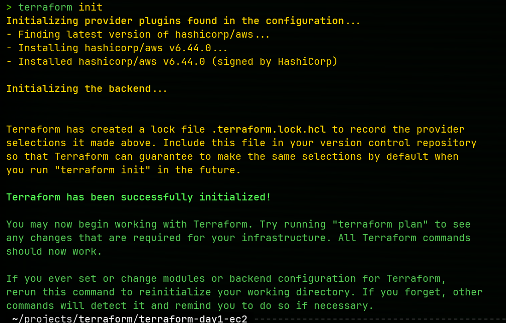
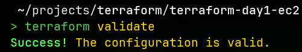
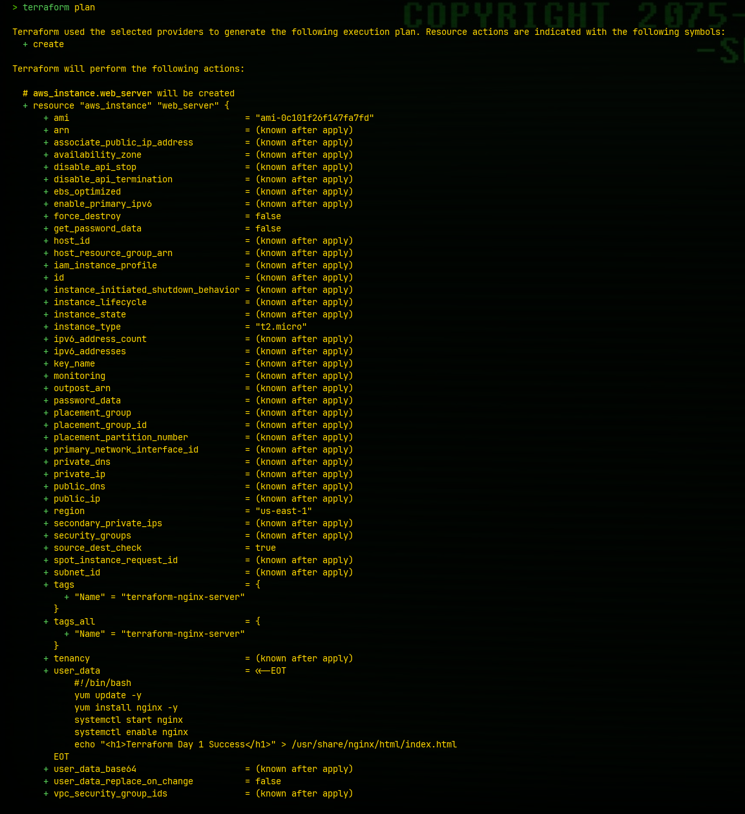
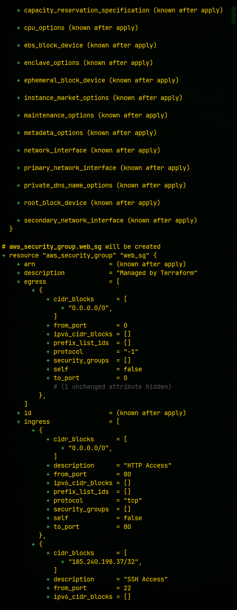
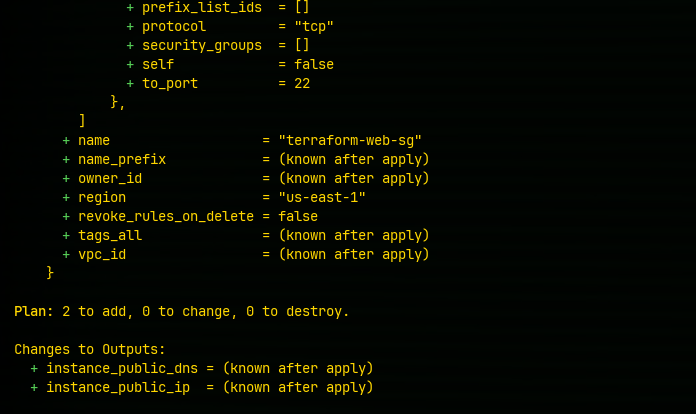
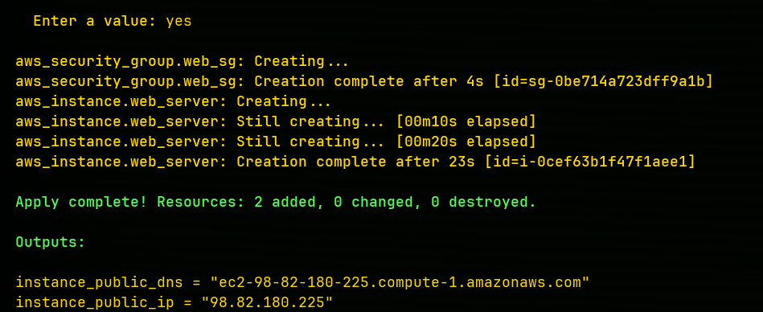
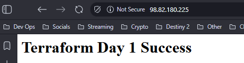
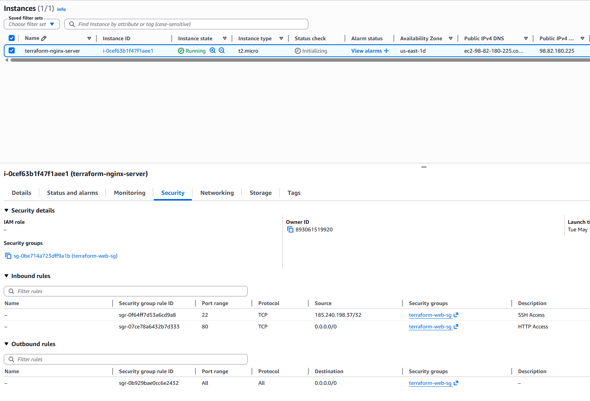
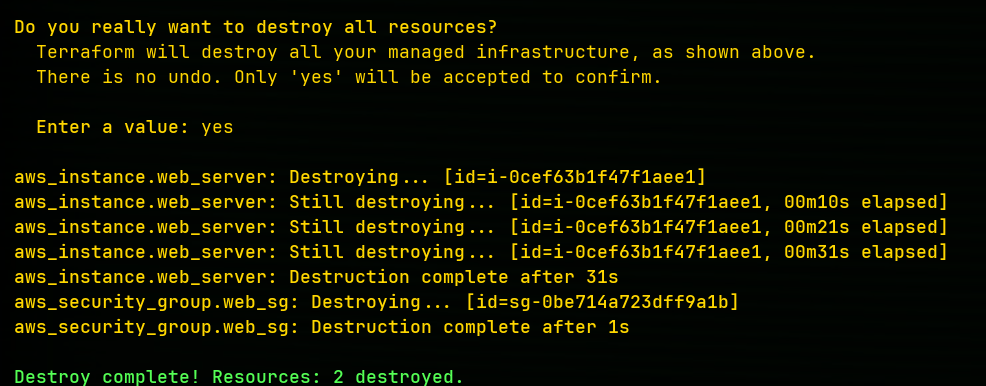

# Terraform Day 1 - EC2 Nginx Deployment

## Overview

This project demonstrates how to deploy an AWS EC2 instance using Terraform.

The deployment included:

- EC2 Instance
- Security Group
- Nginx Installation
- User Data Automation
- Terraform Outputs
- Infrastructure Cleanup

---

## Technologies Used

- Terraform
- AWS EC2
- AWS Security Groups
- Amazon Linux
- Nginx
- Bash Scripting

---

## Commands Used

### Initialize Terraform

```bash
terraform init
````

### Validate Configuration

```bash
terraform validate
```

### Preview Infrastructure

```bash
terraform plan
```

### Deploy Infrastructure

```bash
terraform apply
```

### Destroy Infrastructure

```bash
terraform destroy
```

---

## Screenshots

### Terraform Init



### Terraform Validate



### Terraform Plan







### Terraform Apply



### Successful Deployment



### AWS EC2 Instance



### Terraform Destroy



---

## What I Learned

* How Infrastructure as Code works
* How Terraform provisions AWS resources
* How Security Groups manage traffic
* How user_data automates server configuration
* How to safely destroy infrastructure to avoid AWS charges
