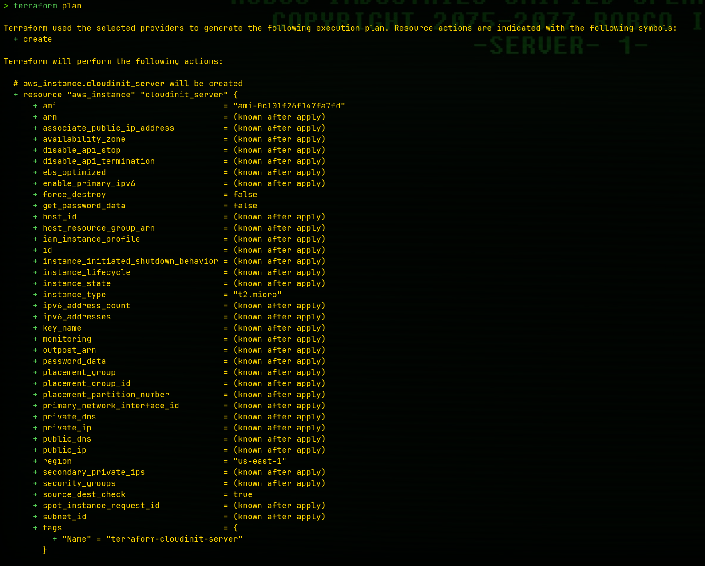
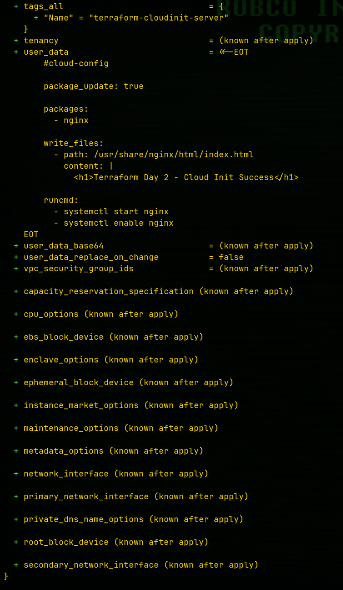
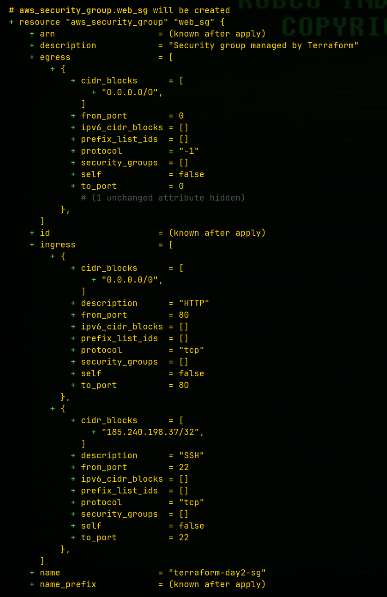
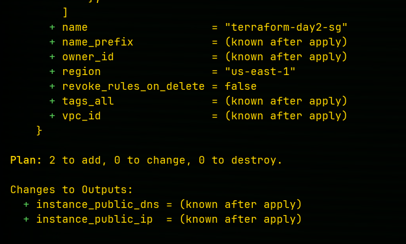
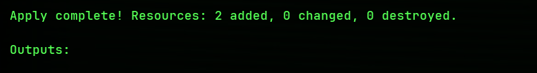
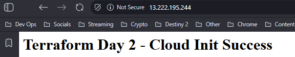
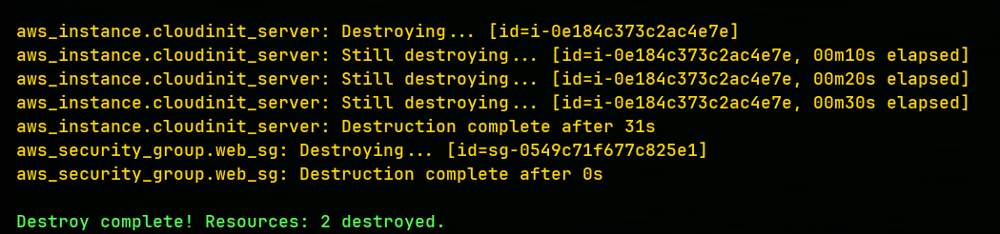

# Terraform Day 2 - Cloud-Init Deployment

## Overview

This project demonstrates how to provision an AWS EC2 instance using Terraform and configure it using Cloud-Init.

The deployment included:

- EC2 Instance
- Security Group
- Cloud-Init Configuration
- Automated Nginx Installation
- Custom Web Page Deployment
- Infrastructure Cleanup

---

## Technologies Used

- Terraform
- AWS EC2
- Cloud-Init
- YAML
- Nginx
- Linux

---

## Commands Used

### Initialize Terraform

```bash
terraform init
````

### Validate Configuration

```bash
terraform validate
```

### Preview Infrastructure

```bash
terraform plan
```

### Deploy Infrastructure

```bash
terraform apply
```

### Destroy Infrastructure

```bash
terraform destroy
```

---

## Screenshots

### Terraform Plan









### Terraform Apply



### Successful Cloud-Init Deployment



### Terraform Destroy



---

## Cloud-Init Example

```yaml
#cloud-config

package_update: true

packages:
  - nginx

runcmd:
  - systemctl enable nginx
  - systemctl start nginx
```

---

## What I Learned

* How Cloud-Init automates EC2 provisioning
* How Terraform loads external YAML files
* The difference between Bash user_data and Cloud-Init
* How to automate package installation
* Why reusable variables improve Terraform configurations
* How to safely destroy infrastructure after testing
