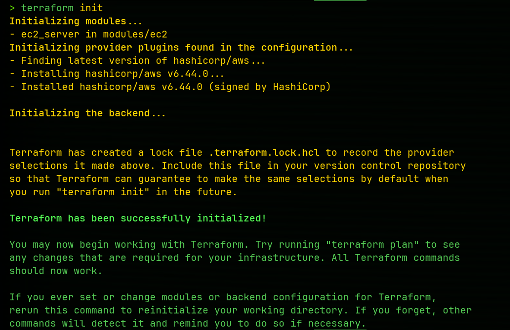
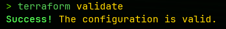
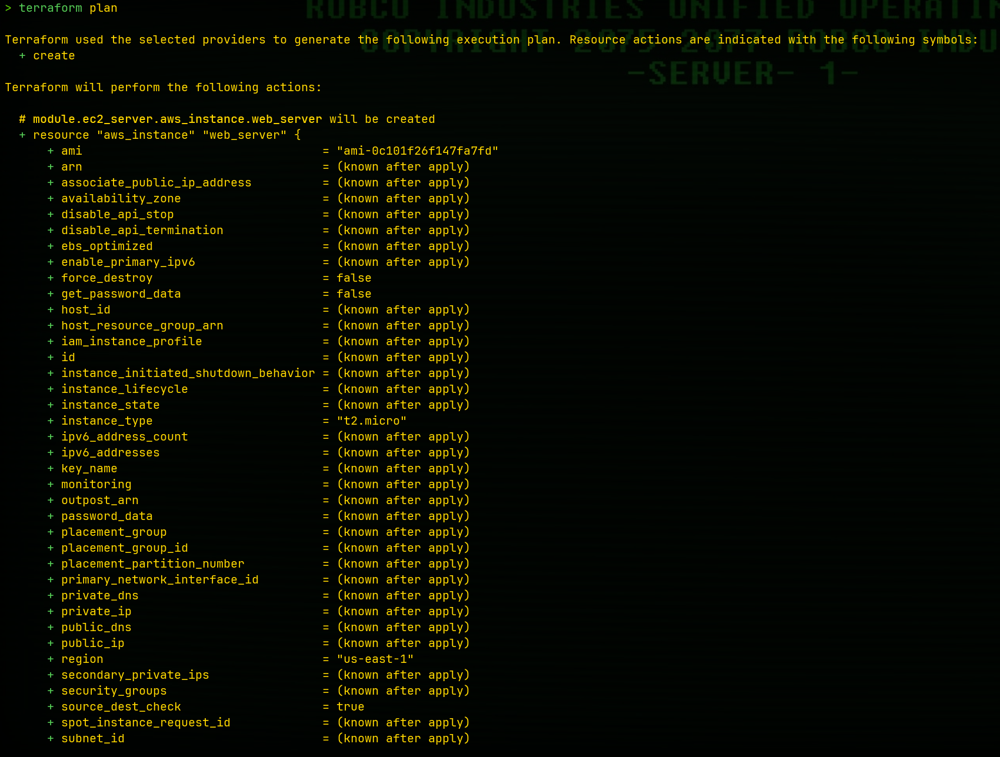
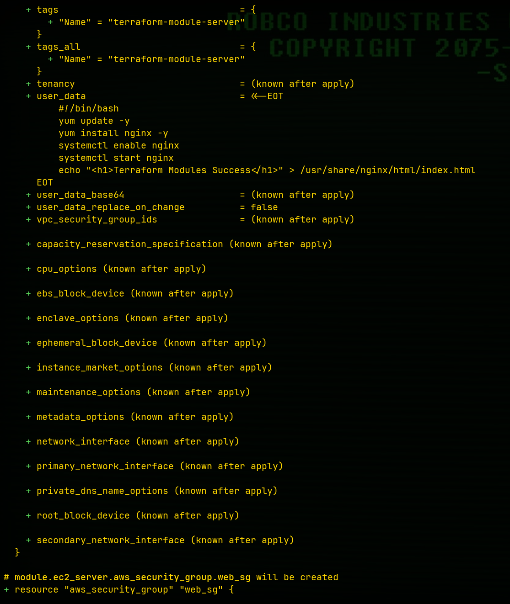
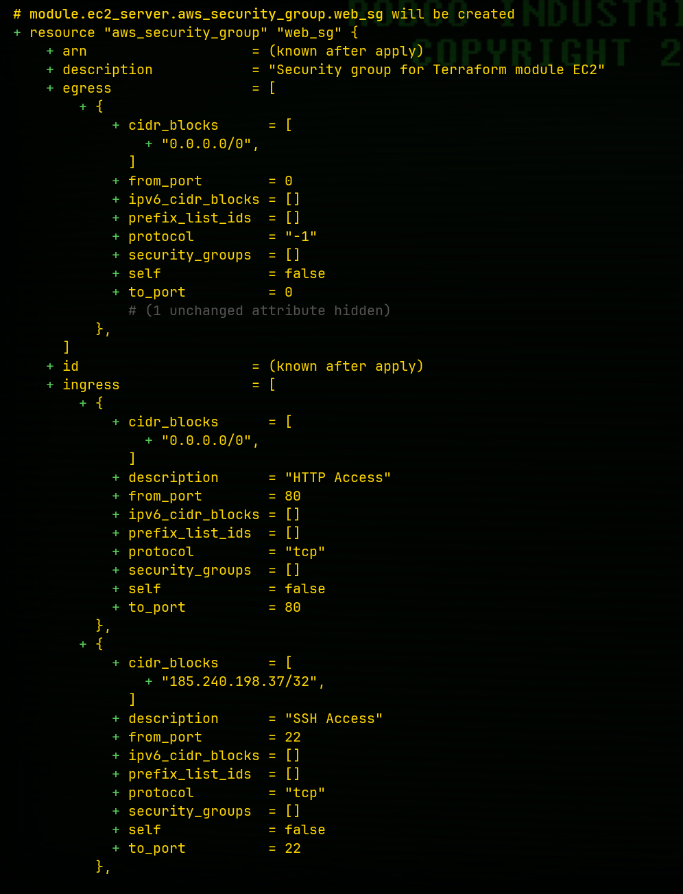
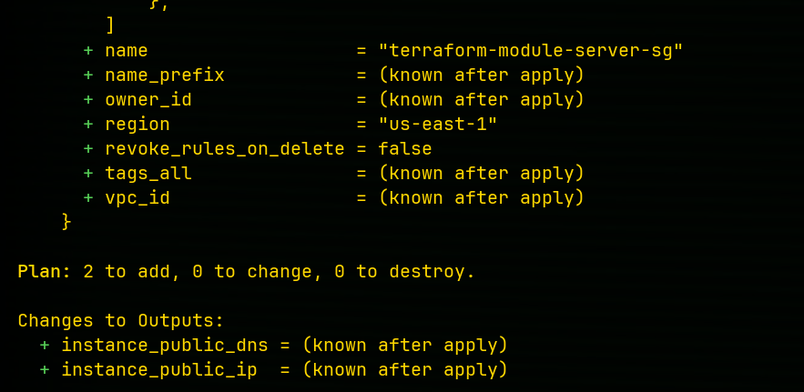
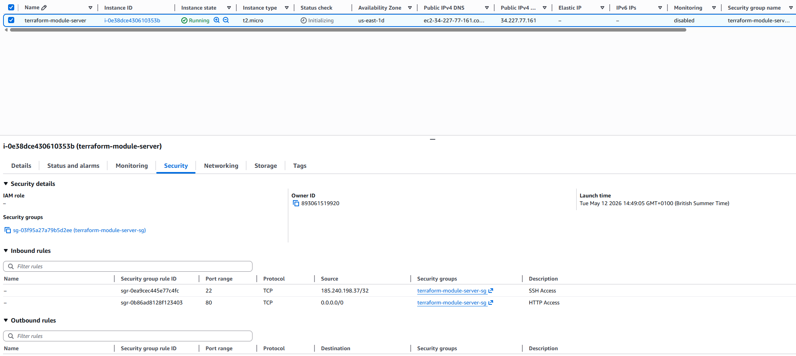
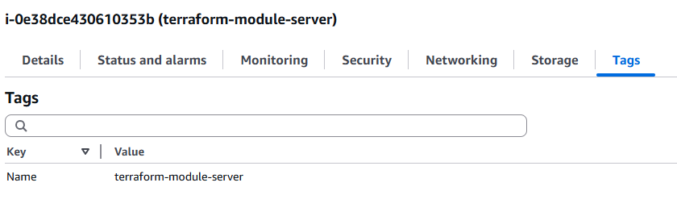
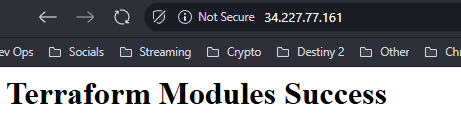
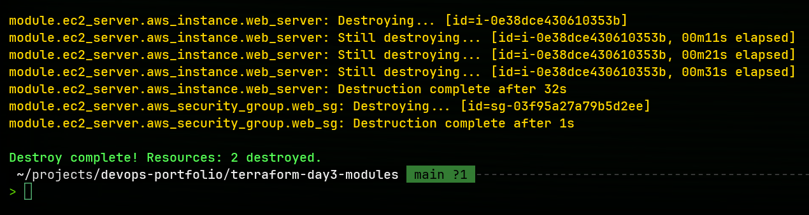

# Terraform Day 3 - Terraform Modules

## Overview

This project demonstrates how to create reusable Terraform modules for AWS infrastructure deployment.

The deployment included:

- Reusable EC2 Module
- Module Variables
- Module Outputs
- AWS EC2 Instance
- Security Group Configuration
- Nginx Installation
- Infrastructure Destruction

---

## Technologies Used

- Terraform
- AWS EC2
- AWS Security Groups
- Terraform Modules
- Amazon Linux
- Nginx
- Bash Scripting

---

## Project Structure

```bash
.
├── main.tf
├── variables.tf
├── outputs.tf
├── terraform.tfvars
└── modules
    └── ec2
        ├── main.tf
        ├── variables.tf
        └── outputs.tf
```

---

## Commands Used

### Initialize Terraform

```bash
terraform init
```

### Validate Configuration

```bash
terraform validate
```

### Review Execution Plan

```bash
terraform plan
```

### Deploy Infrastructure

```bash
terraform apply
```

### Destroy Infrastructure

```bash
terraform destroy
```

---

## Screenshots

### Terraform Init



---

### Terraform Validate



---

### Terraform Plan









---

### EC2 Instance Running



---

### EC2 Tags



---

### Browser Verification



---

### Terraform Destroy



---

## Key Concepts Learned

- Terraform modules
- Reusable infrastructure
- Root modules vs child modules
- Module variables
- Module outputs
- Infrastructure modularization
- AWS automation with Terraform
